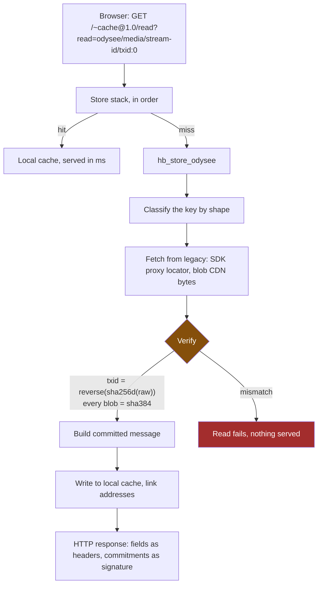

# Odysee on HyperBEAM

Odysee served from a single HyperBEAM node. Legacy Odysee infrastructure is a
byte source only: every fact the node serves is re-derived from raw bytes and
carried as a commitment, so a client never has to trust the node.

Verified working: the UI loads from the node, a real video plays, and every
byte was hash-checked on the way through.

---

## What it is

**Four devices and five stores.** No application devices.

| | |
|---|---|
| `lbry@1.0` | verification only, proves LBRY evidence |
| `odysee-auth@1.0` | session to account to signing key |
| `search@1.0`, `reply-id@1.0` | generic full-text, write-reply shim |
| `hb_store_odysee` | the compatibility boundary: classify a legacy id, fetch, verify, cache |
| 4 x `hb_store_lbry_*` | transaction, claim output, stream descriptor, blob |

The old design had 25+ application devices (`odysee-claim@1.0`,
`odysee-stream@1.0`, ...). They are gone. Reads are store reads, so anything
that can read a HyperBEAM store can read Odysee content: `~query@1.0`, a peer
node, a router such as weave.space.

Why that matters operationally: every custom device must be trust-pinned by
every node operator who wants to serve your content. Four pins is a different
proposition from twenty-five.

## The flow



Read-through caching: the first read pays for legacy, everything after is
local. Same object measured on the demo: **3.4s cold, 0.002s warm**.

The response *is* the proof:

```
txid:            d22e243be78d...
raw:             AQAAAAKConULCnjLdPQnQ43-Vpqt...
signature-input: comm-...=("raw" "txid");alg="lbry@1.0/sha-256d"
```

Recompute `reverse(sha256d(raw))`, compare to `txid`. The node is a transport,
not an oracle.

## Run it locally

Needs Erlang/OTP 27+, rebar3, node >= 22.12, and network access to Odysee.

```sh
# 1. Build the UI. The node API must be baked in at BUILD time.
cd frontend
corepack enable && corepack prepare pnpm@10.33.0 --activate
pnpm install
NODE_ENV=production ODYSEE_HYPERBEAM_NODE_API=http://127.0.0.1:18800 pnpm build

# 2. Build the preloaded device store, once.
cd .. && HB_PORT=18734 rebar3 device local     # ctrl-C twice once it boots

# 3. Start the node and publish the UI into it.
#    One line. rebar3 shell ignores multi-line --eval and races EOF, hence the sleep.
HB_PRELOADED_STORE=_build/device-local-store rebar3 shell --eval 'Opts = hb_odysee_node:seed_opts(#{<<"port">> => 18800, <<"priv-wallet">> => ar_wallet:new(), <<"http-extra-opts">> => #{<<"force-message">> => true, <<"cache-control">> => [<<"no-store">>]}}), Node = hb_http_server:start_node(Opts), {ok, M} = hb_odysee_ui:publish("frontend/web/dist/public", Opts), io:format("~n=== NODE ~s~n=== MANIFEST ~s~n", [Node, M]), receive stop -> ok end.' < <(sleep 100000)
```

Then open, using the manifest id it prints:

```
http://127.0.0.1:18800/<MANIFEST>/#/@conculturepodcast:c/what-if-anakin-won-star-wars-alternate:b
```

`cache-control => no-store` is required. Without it the resolution cache pins
mutable locators at constant addresses and stale claims get served.

### Tests

```sh
rebar3 device test --with-core        # 252 tests. --with-core is required,
                                      # plain `device test` runs 91 and skips
                                      # the whole store layer
ODYSEE_LIVE=1 rebar3 device test --with-core   # adds live-infrastructure test
```

## What works

Claims, channels, streams, transactions, descriptors, blobs, video playback,
auth, search. All cryptographically verified, cached locally after first
fetch, and addressable by a plain HyperBEAM id.

## What does not

- **Comments, uploads, reactions, view and subscriber counts, moderation.**
  Those devices were deleted and have not been rebuilt. This is the real gap.
- **Homepage tiles.** Claims resolve, but the frontend wants decoded display
  metadata that evidence messages do not carry.
- **Seeking.** `dev_cache` drops the request, so Range headers never reach the
  store. Whole-object playback only.
- **Account banner.** Expected, there is no account backend.
- **Known bug:** `GET /<alias>` returns the bytes but **no commitments**, so
  an alias fetch is not verifiable. Use the `/~cache@1.0/read?read=...` form
  when the proof matters. Details and the failing test are in
  `ARCHITECTURE_READ_PATH.md`.

## Read next

`ARCHITECTURE_READ_PATH.md` traces the whole read path in 26 steps with
file:line references.
