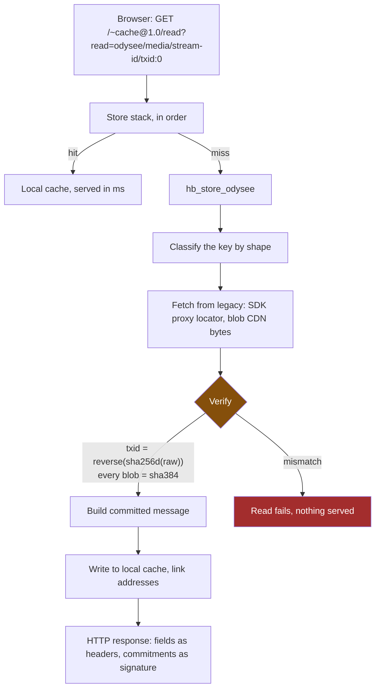

# Odysee on HyperBEAM

Odysee served from a single HyperBEAM node. Legacy Odysee infrastructure is a
byte source only: every fact the node serves is re-derived from raw bytes and
carried as a commitment, so a client never has to trust the node.

Verified working: the UI loads from the node, a real video plays, and every
byte was hash-checked on the way through.

---

## What it is

**Five devices and five stores.** No application devices.

| | |
|---|---|
| `lbry@1.0` | verification only, proves LBRY evidence |
| `odysee-auth@1.0` | session to account to signing key |
| `search@1.0`, `reply-id@1.0` | generic full-text, write-reply shim |
| `reference@1.0` | generic stable identity above immutable playlist snapshots |
| `hb_store_odysee` | the compatibility boundary: classify a legacy id, fetch, verify, cache |
| 4 x `hb_store_lbry_*` | transaction, claim output, stream descriptor, blob |

The old design had 25+ application devices (`odysee-claim@1.0`,
`odysee-stream@1.0`, ...). They are gone. Reads are store reads, so anything
that can read a HyperBEAM store can read Odysee content: `~query@1.0`, a peer
node, a router such as weave.space.

Why that matters operationally: every custom device must be trust-pinned by
every node operator who wants to serve your content. Five pins is a different
proposition from twenty-five.

## The flow



Read-through caching: the first read pays for legacy, everything after is
local. Same object measured on the demo: **3.4s cold, 0.002s warm**.

The response *is* the proof:

```
txid:            d22e243be78d...
raw:             AQAAAAKConULCnjLdPQnQ43-Vpqt...
signature-input: comm-...=("raw" "txid");alg="lbry@1.0/sha-256d"
```

Recompute `reverse(sha256d(raw))`, compare to `txid`. The node is a transport,
not an oracle.

## Run it locally

Needs Erlang/OTP 27+, rebar3, node >= 22.12, and network access to Odysee.

```sh
# 1. Build the UI from the tracked odysee-frontend/, which carries the
#    store-first data layer. The node API must be baked in at BUILD time,
#    and the manifest profile (relative base, node-safe asset names) is
#    required for serving from the node.
cd odysee-frontend
corepack enable && corepack prepare pnpm@10.33.0 --activate
pnpm install
ODYSEE_HYPERBEAM_NODE_API=http://127.0.0.1:18801 pnpm run build:manifest

# 2. Build the preloaded device store, including the pinned reference device.
cd .. && HB_PORT=18734 rebar3 odysee-local     # ctrl-C twice once it boots

# 3. Start the configured cookie-auth node and publish the UI into its store.
#    config.json owns port 18801, the writable store/match index, and the
#    auth/reply-id/manifest hooks. Keep this shell running while testing.
HB_CONFIG=config.json HB_PRELOADED_STORE=_build/device-local-store rebar3 shell --eval '{ok, Config} = hb_opts:load("config.json", hb_opts:default_message_with_env()), [_, Writable | _] = maps:get(<<"store">>, Config), PublishOpts = Config#{<<"store">> => [Writable], <<"match-index">> => [Writable]}, {ok, M} = hb_odysee_ui:publish("odysee-frontend/web/dist/public", PublishOpts), io:format("~n=== MANIFEST ~s~n", [M]), receive stop -> ok end.'
```

Then open, using the manifest id it prints:

```
http://127.0.0.1:18801/<MANIFEST>/#/@conculturepodcast:c/what-if-anakin-won-star-wars-alternate:b
```

`cache-control => no-store` is required. Without it the resolution cache pins
mutable locators at constant addresses and stale claims get served.

### Tests

```sh
rebar3 eunit-all                      # core plus every packaged device,
                                      # including canonical reference tests
ODYSEE_LIVE=1 rebar3 eunit-all        # adds live-infrastructure test
```

## What works

Claims, channels, streams, transactions, descriptors, blobs, video playback,
auth, search. All cryptographically verified, cached locally after first
fetch, and addressable by a plain HyperBEAM id.

## Writes: uploads, channels, comments, reactions, playlists, subscriptions

Native content never touches LBRY. Boot the node with
`hb_odysee_node:upload_opts/1` instead of `seed_opts/1` and the stock auth
hook turns any POST carrying the `!` commit flag into a committed, stored,
queryable message, signed with a cookie-derived per-user wallet, so a
browser needs no wallet. No new devices; the whole plane is node options.

```sh
# Upload a video. The reply's message-id is its permanent address.
curl -b jar -c jar -X POST "$NODE/id?!=true&committers=all" \
  -H "content-type: video/mp4" -H "type: stream" -H "title: my video" \
  --data-binary @video.mp4

# It now serves, byte-exact and signed, at:
#   GET /<message-id>

# Who am I? The profile's commitment names its committer:
curl -b jar -c jar -X POST "$NODE/id?!=true&committers=all" \
  -H "type: channel" -H "name: my channel"          # -> <profile-id>
curl "$NODE/<profile-id>/commitments/<profile-id>/committer"   # -> <address>

# Tag uploads with `channel: <address>`; the channel page is a query:
curl -X POST "$NODE/~query@1.0/only" -H "type: stream" \
  -H "channel: <address>" -H "only: type,channel" -H "return: paths"

# Comments reference the video id:
curl -X POST "$NODE/id?!=true&committers=all" \
  -H "type: comment" -H "parent: <video-id>" --data-binary "nice one"

# Likes and dislikes are generic committed reaction messages:
curl -b jar -c jar -X POST "$NODE/id?!=true&committers=all" \
  -H "content-type: application/json" \
  --data-binary '{"schema":"odysee-reaction@1.0","type":"reaction","reaction-ref":"<stable-ref>","version-ref":"<version-ref>","target":"<video-or-comment-id>","subject":"content","reaction":"like","state":"active","operation":"set","revision":0,"event-timestamp":<milliseconds>,"signature-scope":"native-reaction-v1"}'

# Public playlists are full ordered immutable snapshots. The returned
# message-id is an exact /$/playlist/<message-id> route. A query can return a
# different verified commitment locator for the same signed snapshot.
curl -b jar -c jar -X POST "$NODE/id?!=true&committers=all" \
  -H "content-type: application/json" \
  --data-binary '{"schema":"odysee-playlist@1.0","type":"playlist","profile-id":"<profile-id>","profile-name":"my channel","title":"My playlist","items-json":"[\"<immutable-video-id>\"]","item-count":1,"tags-json":"[]","languages-json":"[]","created-at":<milliseconds>,"signature-scope":"native-playlist-v1"}'

# Free channel follows use a deterministic owner/channel relationship. Later
# notification changes and unfollows append revision-of/previous-version.
curl -b jar -c jar -X POST "$NODE/id?!=true&committers=all" \
  -H "content-type: application/json" \
  --data-binary '{"schema":"odysee-subscription@1.0","type":"subscription","subscription-ref":"<committer>.lbry:<full-channel-claim-id>","channel-ref":"lbry:<full-channel-claim-id>","channel-uri":"lbry://@channel#<full-channel-claim-id>","channel-name":"@channel","profile-id":"<profile-id>","profile-name":"my profile","notifications-disabled":true,"state":"active","operation":"follow","origin":"native","revision":0,"version-ref":"<version-ref>","created-at":<milliseconds>,"updated-at":<milliseconds>,"signature-scope":"native-subscription-v1"}'
```

The query is convention; the proof is the commitment. A listing reader keeps
entries the claimed channel signed (anyone can claim any `channel` key, nobody
can forge the signature). Membership, not sole authorship: because storage is
content addressed, an attacker can re-upload a video's public bytes to co-sign
the shared object, so demanding the channel be the only signer would let them
censor a genuine upload. The write-plane tests in `hb_odysee_node` drive all
of this over HTTP, both the spoof and the censorship attempt.

## What does not

- **View and subscriber counts, advanced moderation.** Not rebuilt.
- **Homepage tiles.** Claims resolve, but the frontend wants decoded display
  metadata that evidence messages do not carry.
- **Seeking.** `dev_cache` drops the request, so Range headers never reach the
  store. Whole-object playback only.
- **Account banner.** Expected, there is no account backend.
- **Zero-result query handling.** Unpatched nodes return HTTP 500 when
  `~query@1.0` has no results because of an upstream `case_clause` in
  `dev_query:match/4`. `patches/dev-query-match-error-tuple.patch` returns
  type-correct empty aggregates and retains `not_found` for first-item modes.

By design, not a bug: `GET /<alias>` returns the bytes but no commitments.
An alias is a hash of a *path*, so it has no cryptographic relationship to
the content and cannot name the content's proof. The verifiable plain id is
the `lbry@1.0` commitment id, and `GET /<commitment-id>` does carry the
proof; so does the canonical `/~cache@1.0/read?read=...` form. Aliases and
bare outpoints are locators. See `skeleton_blob_serves_and_addresses_test`
in `hb_odysee_node` for both halves, and `ARCHITECTURE_READ_PATH.md` for the
full read path.

## Read next

`ARCHITECTURE_READ_PATH.md` traces the whole read path in 26 steps with
file:line references.
