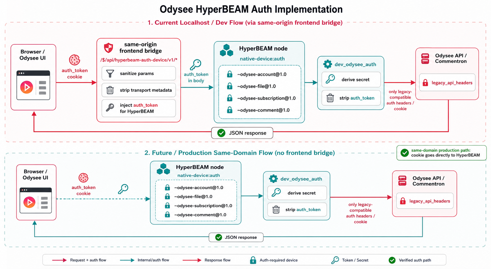
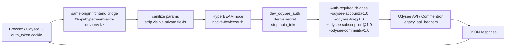

# Current HyperBEAM Auth Implementation



This is the current Odysee auth path for HyperBEAM-backed authenticated reads and writes.

## Flow



## Current Localhost Path

The browser cannot send an `odysee.com` cookie directly to a local HyperBEAM node on `127.0.0.1:10000`. The current local implementation uses the frontend server as a same-origin bridge:

1. The UI posts auth-required device requests to `/$/api/hyperbeam-auth-device/v1/*`.
2. The frontend server reads `auth_token` from the incoming same-origin cookie.
3. The bridge forwards the request to the HyperBEAM node and attaches the token for `dev_odysee_auth`.
4. `dev_odysee_auth` derives the request secret and removes token fields from the normalized request.
5. Odysee legacy APIs receive only the legacy-compatible auth carrier needed for the specific operation.

Relevant files:

- `odysee-frontend/ui/util/hyperbeam.ts`
- `odysee-frontend/web/src/routes.js`
- `hyperbeam/src/preloaded/auth/dev_odysee_auth.erl`
- `hyperbeam/src/preloaded/odysee/dev_odysee_account.erl`
- `hyperbeam/src/preloaded/odysee/dev_odysee_comment.erl`
- `hyperbeam/src/preloaded/odysee/dev_odysee_file.erl`
- `hyperbeam/src/preloaded/odysee/dev_odysee_subscription.erl`

## Same-Domain Production Path

On the intended same-domain deployment, the browser and HyperBEAM live under the same origin. The browser can send the `auth_token` cookie directly to HyperBEAM with normal browser credential handling.

```text
https://odysee.com
  Browser / UI
    POST /~odysee-file@1.0/view-count?!=true
    Cookie: auth_token=...

  HyperBEAM node
    dev_odysee_auth reads auth_token
    derives secret
    strips auth_token
    routes to native-device:auth implementation
```

In that setup, the frontend bridge is not needed for cookie-domain bypassing. It can remain useful as a local development shim, but the target path is direct same-origin cookie auth through HyperBEAM.

## Auth-Required Device Set

The frontend marks these as `native-device:auth` and routes them through the auth bridge:

- `~odysee-account@1.0`: preferences and settings.
- `~odysee-comment@1.0`: create, edit, pin, abandon, reactions, settings, moderation.
- `~odysee-file@1.0`: view counts.
- `~odysee-file-reaction@1.0`: reaction lists.
- `~odysee-subscription@1.0`: subscription counts.
